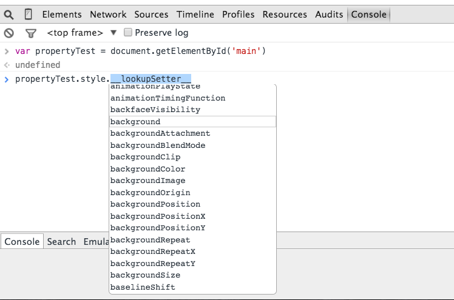

# JavaScript and the DOM - a primer

Let's look at the basics of using *vanilla* JavaScript to manipulate the DOM...

1. [Overview](#overview)
1. [Setup](#setup)
1. [Discussion](#discussion)
1. [Activity](#activity)
1. [Stretch Goals](#stretch-goals)
1. [Reflect](#reflect)
1. [Further Reading](#further-reading)

## Overview

- Be sure to figure out the "what" and "why" by reading through the sections slowly, really trying to answer *each* question before looking at the solution.
- REMEMBER! It's about the process. There's no rush. Take risks, and have fun! Don't be afraid to make mistakes and try things.

### Why should you care?

DOM operations form the basis of all client-side javascript, and all frameworks including jQuery and Angular ultimately just boil down to these calls. Knowing what the DOM is and how to use it is an essential skill for web developers, and many of the in-class assignments will include these DOM operations.

### Objectives

By the end of this lesson you should be able to:

- describe javascript’s role in manipulating the DOM
- explain that HTML attributes are default (initial) values for DOM properties
- explain that DOM properties can be altered after initial page load
- explain that the DOM provides a way for programs to change the structure, style, and content on a page dynamically
- explain the difference between a text node and an element
- find an element by id, tagname, classname, and more advanced CSS selectors
- set an element’s innerHTML and text
- construct and add simple elements to the DOM
- remove elements from the dom
- detach and reattach DOM elements
- access properties of DOM elements such as text, html, value
- create and access data-attributes on elements
- add syntactically valid event listeners using named and anonymous functions

### Key terms

1. DOM Traversal
1. DOM Manipulation
1. DOM Events
1. Event Handling

## Setup

1. Create a new local project directory called "js-dom-basics".
1. Add a local git repository.
1. Create a remote repository on Github.
1. Add a *main.js* file.
1. Add a simple `console.log("sanity check!")` in *main.js* to verify that it's included correctly. **How do you test this?**
1. Finally, add/commit to your local git repo, and then push your changes to Github.

## Discussion

Look over the *index.html* file before starting...

```html
<!DOCTYPE html>
<html>
<head>
  <title>JavaScript and the DOM - a primer</title>
</head>
<body>

  <section>

    <h1>Just a header</h1>

    <p id="main">Just a paragraph...</p>

    <ul>
      <li>item 1</li>
      <li>item 2</li>
      <li>item 3</li>
      <li>item 4</li>
      <li>item 5</li>
    </ul>

    <button id="main-button">Just a button</button>

  </section>

  <script type="text/javascript" src="main.js"></script>

</body>
</html>
```

### Targeting and Traversal

#### `getElementbyID`

Add the following code to your JavaScript file:

```javascript
var firstParagraph = document.getElementById('main');
console.log(firstParagraph);
```

Open the JavaScript console in Chrome. **What do you see?**

```javascript
<p id="main">Just a paragraph...</p>
```

**What does this give us?**

Since we are assigning the [DOM node](http://www.w3schools.com/jsref/dom_obj_all.asp) - `<p id="main">Just a paragraph...</p>` - to a variable, we now have a reference to it. With the node in hand, we can now its content (tags, attributes, inner text - **what are these?**), manipulate/change any part of it (attributes, inner text, etc.) after the page load, move it, or remove the node altogether. JavaScript gives us this power!

Any node within the [document](http://www.w3schools.com/js/js_htmldom_document.asp), the root node, can be accessed via JavaScript. **What if we wanted to target (or access) the list?**

Without an `id` attribute, we need to use a different [method](http://www.w3schools.com/jsref/dom_obj_all.asp)...

#### `getElementsByTagName`

The `getElementsByTagName()` method returns a collection/array of nodes. These collections are "live", which means that if you add a new HTML element to the collection, it will also be added to the DOM. You can treat the collection just like you would a normal JavaScript array.

Add the following code to your JavaScript file:

```javascript
var getAllElements = document.getElementsByTagName('ul');
console.log(getAllElements)

var getSingleElement = document.getElementsByTagName('ul')[0];
console.log(getSingleElement)
```

Again, open your JS console. **What do you see?**

```javascript
[ul]

<ul>
  <li>item 1</li>
  <li>item 2</li>
  <li>item 3</li>
  <li>item 4</li>
  <li>item 5</li>
</ul>
```

The first example outputs the *entire* collection while the second example outputs the *first* (and only) element in the collection.

**Can you guess what the following code will do?**

```javascript
var allListItems = document.getElementsByTagName('li');
```

Test it out. Assign it to a variable called `allListItems`, and then log the variable to the console. If all went well, you should see a collection that contains *all* `li`s.

Finally, let's loop through the collection, outputting each *individual* element to the console:

```javascript
for (var i = 0; i < allListItems.length; i++) {
  console.log(allListItems[i]);
}
```

**What if we wanted to simply view the text within each list item, rather than the entire element?**

Simply update the loop like so:

```javascript
for (var i = 0; i < allListItems.length; i++) {
  console.log(allListItems[i].innerText);
}
```

**What will this do?**


```javascript
for (var i = 0; i < allListItems.length; i++) {
  console.log(allListItems[i].innerText = i);
}
console.log(allListItems);
```

Test it out!

#### `innerText` vs `innerHTML`

Research this on your own. **How would you construct the Google query to find a solution quickly?**

Ideally, after you search, you should find an answer within the first three results. If not, redefine your search query, as, more often than not, the current results are *unlikely* to be relevant. This begs the question - **What constitutes a good search result?** Think about this for a minute - or two. Think about when you constructed a good search query vs. a poor search query. Which sites produced a good result? [StackOverflow](http://stackoverflow.com/), [MDN JavaScript](https://developer.mozilla.org/en-US/docs/Web/JavaScript), and [w3schools JavaScript](http://www.w3schools.com/js/) generally yield good results. Over time, you will find that as the complexity and granularity of the subject increases, the less you can rely on mainstream resources to produce quality results. Often you will have to rely on less popular areas on [StackOverflow](http://stackoverflow.com/) as well as personal blog posts. Keep this in mind. Practice. Practice. Practice.

> Also, keep in mind, that the more esoteric subjects are generally ones that people are talking less about, which gives you an opportunity to participate. The more you participate, the more you will be recognized as a thought leader in the community. Thought leaders don't have to look for jobs - jobs come to them.

#### `createElement`

`createElement()` does just as the name suggests - it creates an [element node](http://www.w3schools.com/jsref/prop_node_nodetype.asp).

Let's add another list element to the unordered list:

1. Create the element

  ```javascript
  var li = document.createElement('li');
  console.log(li);
  ```

  You should now have a `<li></li>` tag.

1. Add text to the `li` element

  ```javascript
  var newElement = li.innerText = "another list item";
  console.log(newElement);
  console.log(li);
  ```

  The new element should now have text - `<li>another list item</li>`

1. Add child element to the list

  ```javascript
  getSingleElement.appendChild(li);
  console.log(allListItems);
  ```

  The list should now look like:

  ```html
  0
  1
  2
  3
  4
  another list item
  ```

**What if you wanted to prepend the element?**

```javascript
var anotherListElement = document.createElement('li');
anotherListElement.innerText = "prepend";
console.log(anotherListElement);
getSingleElement.insertBefore(anotherListElement, getSingleElement.firstChild);
console.log(allListItems);
```

Make sense? Prepend another element. Try removing an element with `removeChild()`. Once done, show an instructor.

#### Traversing the DOM

In the last section, you were introduced to DOM traversal, which is simply the action of traveling up and down through the DOM in order to target a specific Node.

Read about traversing the DOM [here](http://javascript.info/tutorial/traversing-dom). Once done, make sure you understand, conceptually, what the following methods do:

1. `childNodes()` - targets all child nodes, returning a collection
1. `firstChild()` - targets the first child node
1. `lastChild()` - targets the last child node
1. `parentNode()` - targets the parent node from the current node
1. `nextSibling()` - targets the next node at the same level as the current node
1. `previousSibling()` - targets the previous node at the same level as the current node

Now, go back and experiment with each first in the console before you update the *main.js* file.

### Manipulation

Moving on from accessing nodes and traversing the DOM, let's look at manipulating elements. First off, each node can be manipulated via its properties/HTML attributes.

Add the following code to the *main.js* file:

```javascript
document.getElementById('main').style.backgroundColor = "red";
```

**What happened when you refreshed the page?**

> Notice how we used a CSS property name in camelCase (`backgroundColor`), rather than in dash-case (`background-color`), so that they are accessible within the JavaScript file.

Play around with some other style properties to manipulate the DOM. For example, change the background color of each of the list items.

**Don't know what to manipulate?**

With the JavaScript Console open, follow these steps:

1. Again, target the node with an id of `main` - `var propertyTest = document.getElementById('main')`
1. Then type `propertyTest.style.`, and as soon as you type the dot (`.`) at the end, a drop down list will appear, showing you the available properties based on the `style` property:

  

1. Choose something applicable to that specific HTML tag and add a new style. Simple, right?
1. Practice!

### Events

Events are paramount to any web application. With events, we can define actions to take place based on something (the event) that happens. For example, let's say your HTML document has a button that when clicked (the event) an alert informs the user of something. Thus, you can add listeners to, well, listen for events to occur and then have something happen when the event fires.

#### Common Events

Read about the different DOM events [here](http://www.w3schools.com/jsref/dom_obj_event.asp), taking note of the most commonly used:

Mouse events:

- `mousedown()`
- `mouseup()`
- `click()`
- `mouseover()`
- `mouseout()`
- `mousemove()`

Keyboard events:

- `keypress()`
- `keydown()`
- `keyup()`

Form events:

- `select()`
- `change()`
- `submit()`
- `reset()`

**Think about scenarios where you'd use each one.**

#### Event Handling

Events are one thing, but handling such events so that they perform an action is where the real fun begins! Wait. **What's an event handler?** Put simply, it's just a function that contains the action that takes place after the event occurs. Keep in mind, that the *all* events happen in the DOM, and they happen regardless of whether or not you're attaching a JavaScript event handler to them.

How about an example? Add the following code to *main.js*:

```javascript
// target the button
var button = document.getElementById('main-button');

// event handler
function buttonClick() {
  console.log('You just clicked the button!');
}

// event registration
button.onclick = buttonClick;
```

Here, on the button click we're logging the text "You just clicked the button!" to the console. You can also write the code in a more concise manner using a nameless, or anonymous, function:

```javascript
// all in one - target, event handler
document.getElementById("main-button").addEventListener("click", function(event){
  console.log('You just clicked the button!');
});
```

Test it out!

Try adding individual listeners to each list element so that when you click the `li`'s text, outputs the text via an `alert()`. Take a look at some of the other events from above, test some of them out.

## Activity

Time to put some of that newfound knowledge into practice. Remember the card game app from last week? Well, it's time to bring life to it via the power of JavaScript!

1. Add an *index.html* and *main.css* file to the project, if you don't already have them.
1. Create the basic HTML structure that you need to initialize the game - a button, perhaps.
1. Add event handlers to your JavaScript file that fires the necessary functions to run your game.
1. Make sure you're also updating the DOM, so the end user can see the results of the game.
1. Using CSS, make your app look nice!

## Stretch Goals

Continue to work with the app, either alone (as homework) or in the group, to add even more functionality. Need ideas? Ask an instructor.

## Reflect

### Self-Assessment

How’d you do? Go back to the "Objectives" section. Go through each one and ask yourself:

- Have I completed this objective?
- What concrete evidence do I have that I've completed the objective?

Rate yourself 1 through 4 for each objective in terms of competence (4 being the highest). If you rate yourself a 2 or below, please notify an instructor for additional help.

Go to the "Key Terms" section.  For each term, ask yourself:

- What is my explanation for this term?

If you haven't completed an objective, or you can't define a term, take a few minutes to try to fill in any gaps.

### Ask new questions

What new questions do you have now that you've gone through this exercise?

## Further Reading

- [The Basics of JavaScript DOM Manipulation](http://callmenick.com/post/basics-javascript-dom-manipulation)
